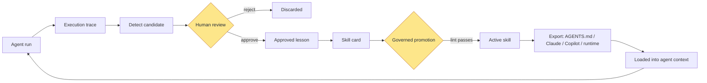
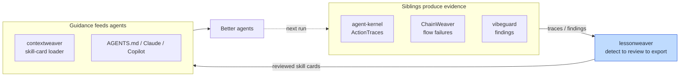

# lessonweaver

[](https://github.com/dgenio/lessonweaver/actions/workflows/ci.yml)
[](https://pypi.org/project/lessonweaver/)
[](https://www.python.org/downloads/)
[](LICENSE)

**Turn your agent's real failures into reviewed `AGENTS.md`, Claude, and Copilot
skills — deterministically, with a human in the loop.**

lessonweaver mines your agent's execution traces for the mistakes it keeps
repeating, puts a **human review gate** in front of every candidate, and exports
the approved ones as the instruction formats teams already use: `AGENTS.md`
fragments, Claude skills / rules / `CLAUDE.md`, GitHub Copilot instructions,
Codex skill directories, and generic runtime snippets.

The human-review gate is the point. Unlike letting a model rewrite its own
instructions, every skill here is reviewed, governed, and auditable — no context
poisoning, no automatic self-training, no skill activation without review. The
core is **deterministic** with no LLM calls. See
[when *not* to create a skill](docs/when-not-to-create-a-skill.md).

## Before / after

- **Before:** A coding agent "reviews" a PR from the title and description
  without inspecting the diff. A human corrects it. The same mistake recurs next
  week.
- **Trace:** The run is recorded, including the `human_correction` event.
- **lessonweaver:** Detects a conservative candidate, a human reviews it via
  multiple-choice questions, and approves it into a reviewed skill.
- **After:** The reviewed lesson is exported as a Markdown/runtime snippet and
  pasted into `AGENTS.md` / Copilot / Claude instructions, so future sessions
  start with "inspect the changed files first."

## What it is / what it is not

| It is | It is not |
| --- | --- |
| A reviewed-guidance layer over agent traces | An agent framework or orchestrator |
| A deterministic detect → review → export loop | An observability/telemetry product |
| A producer of governed instruction fragments | An eval runner |
| Human-gated and auditable | Autonomous self-training or generic memory |

lessonweaver **complements** observability, evals, and memory — see
[comparisons](docs/comparisons.md) and [ecosystem](docs/ecosystem.md).

## How it works

A trace becomes governed guidance only after a human review gate and a governed
promotion gate (shaded). Nothing activates automatically.



The Mermaid source is kept in
[`docs/assets/lessonweaver-lifecycle.mmd`](docs/assets/lessonweaver-lifecycle.mmd).
See [docs/architecture.md](docs/architecture.md) for the module-level data flow.

## Quickstart

The first PyPI release is being prepared
([#64](https://github.com/dgenio/lessonweaver/issues/64)). Until it lands,
install from source:

```bash
pip install -e ".[dev]"
lessonweaver --help
```

> Once published, the user install will be `pip install lessonweaver` (see
> [Contributing](#contributing) for the contributor workflow). The release
> process is documented in [docs/release.md](docs/release.md).

```bash
# 1. Detect candidates from a trace and save them to a temporary registry
lessonweaver detect examples/traces/github_pr_review_failure.json \
  --save --registry-root /tmp/lw

# 2. Generate review questions
lessonweaver interview trace-gh-pr-review-001-human-correction --registry-root /tmp/lw

# 3. Record a review answer
lessonweaver answer trace-gh-pr-review-001-human-correction decision approve \
  --free-text "Diff inspection is required before review conclusions." \
  --registry-root /tmp/lw

# 4. Approve into an operational lesson and skill
lessonweaver approve trace-gh-pr-review-001-human-correction \
  --approved-by reviewer --registry-root /tmp/lw

# 5. Export the reviewed skill for an instruction surface
lessonweaver export-skill skill-trace-gh-pr-review-001-human-correction \
  --format markdown --redact --registry-root /tmp/lw
```

Drop `--registry-root /tmp/lw` to use the default `~/.lessonweaver/registry`.
For full recipes, see the [coding-agent cookbook](docs/cookbook/coding-agents.md).
For a complete worked example with traces, an approved skill, and a validation
suite, see [`examples/coding_agent_pr_review/`](examples/coding_agent_pr_review/).

### Flagship demo: the closed loop

The [`examples/closed_loop_contextweaver/`](examples/closed_loop_contextweaver/)
keystone shows the whole loop end to end: a coding-agent failure → `detect` →
human `approve` → `export-skill` as a skill card → that card **loaded back into an
agent's context** (via
[`example.py`](examples/closed_loop_contextweaver/example.py)) so the next run
starts already knowing not to repeat the mistake. Reproduce the 60-second
terminal demo with [`docs/assets/demo.sh`](docs/assets/demo.sh), which runs the
detect→review→export steps and ends by loading the reviewed card back into
context. *(A recorded GIF/asciinema cast of this flow is tracked as a
follow-up.)*

## Runtime loading

```python
from lessonweaver import FileSystemRegistry, SkillLoader

registry = FileSystemRegistry()
loader = SkillLoader(registry=registry)

context = loader.load_for_task(
    task="Review this PR for security issues",
    agent_type="coding",
    tools=["github"],
    scope="project",
    budget_chars=2000,
)
print(context.snippet)
```

## Commands

- `lessonweaver detect <trace.json> [--save] [--output FILE] [--dry-run]`
- `lessonweaver interview <candidate-id-or-json> [--session FILE] [--dry-run]`
- `lessonweaver resume-interview <session.json>` — reload a saved review and print the remaining (adaptive) questions
- `lessonweaver answer <candidate-id> <question-id> <option-id> [--free-text ...] [--session FILE]`
- `lessonweaver approve <candidate-id> [--approved-by ...] [--dry-run]`
- `lessonweaver export-skill <skill-id-or-json> --format markdown|json|copilot|copilot-repo|copilot-path|claude|claude-skill|claude-rule|claude-md|agents-md|codex|runtime [--applies-to GLOB] [--redact] [--output FILE] [--json] [--dry-run]`
- `lessonweaver export-lesson <candidate-id-or-json> --format eval|guardrail|workflow [--redact] [--output FILE] [--json] [--dry-run]`

Shared output flags: `--output FILE` writes the result to a file instead of stdout;
`--json` wraps `export-skill`/`export-lesson` output in a `{"format": ..., "content": ...}`
envelope for scripting; `--dry-run` previews a command without writing any file or
registry entry (it prints a `[dry-run] would write to: ...` notice when `--output` is set).
The review interview is adaptive: marking a lesson `high` risk or `workflow_change`
queues a follow-up question, and a `reject` decision skips the remaining scoping
questions. Save progress with `interview --session FILE` (a registry-backed candidate
is required so it can be reloaded), record answers into that session with
`answer --session FILE`, and continue later with `resume-interview`, which lists the
remaining adaptive questions from the answers recorded so far.

Commands return non-zero on bad input: a missing file exits `1`, and invalid JSON or
an invalid trace/skill payload exits `2` with an `Error:` message on stderr.
- `lessonweaver review-trace <trace.json> [--answer q=opt] [--approve] [--target FORMAT] [--dry-run]` — one guided command for the whole detect→review→(approve) loop (see the [developer workflow](docs/developer-workflow.md))
- `lessonweaver export-file <skill-id-or-json> --path FILE [--format ...] [--write] [--no-redact]` — diff-first, idempotent insertion of a skill into an instruction file (previews a unified diff unless `--write`)
- `lessonweaver lint <skill-id-or-json>`
- `lessonweaver analyze-skills <skills-dir>`
- `lessonweaver retrieve "<task>"`
- `lessonweaver load "<task>" [--explain]`
- `lessonweaver explain-load "<task>" [--agent-type ...] [--tools ...]` — explain which skills load or are skipped (reason codes), budget usage, and overlaps
- `lessonweaver cleanup-skills [--write]` — report (and optionally apply) cleanup for stale, noisy, and overlapping skills
- `lessonweaver validate-skill <suite.json> [--skills-dir DIR | --registry-root ROOT]`
  - Suite JSON: `{"suite_id": "s1", "skill_id": "pr-review", "examples": [{"example_id": "pos", "task": "Review this pull request", "should_load": true}, {"example_id": "neg", "task": "Generate a SQL migration", "should_load": false}]}`. Negative examples (`should_load=false`) measure precision; the command prints the eval result as JSON and exits `0` when every example passes, `1` otherwise.
- `lessonweaver promote-skill <skill-id> <target-status>`

## Supported outputs and integrations

| Integration | Status |
| --- | --- |
| Markdown skill cards | Supported |
| JSON skill cards | Supported |
| GitHub Copilot instruction fragments | Supported (`copilot`, `copilot-repo`, `copilot-path`) |
| Claude Code skill / rule / CLAUDE.md exports | Supported (`claude`, `claude-skill`, `claude-rule`, `claude-md`) |
| Generic runtime prompt snippets | Supported |
| Codex skill directory export | Supported (`codex`) |
| AGENTS.md fragment export | Supported (`agents-md`) |
| Eval / guardrail / workflow exports | Supported (`export-lesson`) |
| LlamaIndex, OpenAI Agents SDK, Pipecat | Example integrations ([LlamaIndex](examples/llamaindex_runtime_loader/), [OpenAI Agents SDK](examples/openai_agents_runtime_loader/), [Pipecat](docs/integrations/pipecat.md)) |

## Governance and safety

- Detection is conservative; false negatives are preferred over noisy guidance.
- Human review is the enforced governance step before a lesson becomes an
  approved skill: `approve` refuses to run until the required (adaptive) review
  questions are answered. `--allow-incomplete-review` overrides the gate and
  records the bypass in metadata.
- `experimental` skills must pass governed lifecycle checks (lint with no errors)
  before becoming `active`.
- `SimpleRedactor` is a best-effort safety net before export, not a compliance
  control.
- Skills carry owner, approver, expiration, sensitivity, scope, and evidence
  metadata.

See [when not to create a skill](docs/when-not-to-create-a-skill.md) — turning
every observation into a skill causes context poisoning.

## Anti-goals

- No LLM-based lesson generation in the core library.
- No automatic skill injection without human approval.
- No agent orchestration or framework lock-in.
- No replacement for evals, tests, or review gates.
- No compliance-grade privacy scanner.

## Roadmap

Grouped by adoption path (tracking issues):

- **Operational memory:** [#57](https://github.com/dgenio/lessonweaver/issues/57)
- **Runtime lesson retrieval API:** [#59](https://github.com/dgenio/lessonweaver/issues/59)
- **Eval companion:** [#60](https://github.com/dgenio/lessonweaver/issues/60)
- **Closed-loop effectiveness measurement:** [#61](https://github.com/dgenio/lessonweaver/issues/61)
- **Policy-gated lesson promotion:** [#62](https://github.com/dgenio/lessonweaver/issues/62)

## Part of the Weaver Stack

lessonweaver is the **learning loop** of the Weaver Stack — the part that closes
the loop. Sibling tools *produce* evidence (agent-kernel ActionTraces,
ChainWeaver flow failures, vibeguard findings), lessonweaver turns that evidence
into reviewed, governed guidance, and that guidance feeds *back* into agents
(for example, contextweaver can load exported skill cards, or you paste them
into `AGENTS.md`).



lessonweaver **works standalone** — it consumes any trace in the documented
[trace format](docs/trace-format.md) and takes **no hard runtime dependency** on
any sibling. The Mermaid source is in
[`docs/assets/lessonweaver-closed-loop.mmd`](docs/assets/lessonweaver-closed-loop.mmd).

## Documentation

- [Architecture](docs/architecture.md) — modules, data flow, lifecycle
- [Glossary](docs/glossary.md) — canonical terms
- [Comparisons](docs/comparisons.md) — vs. observability, evals, memory, frameworks
- [Ecosystem positioning](docs/ecosystem.md) — integration boundaries
- [When not to create a skill](docs/when-not-to-create-a-skill.md)
- [Developer workflow](docs/developer-workflow.md) — guided review, diff-first export, load diagnostics, cleanup
- [Coding-agent cookbook](docs/cookbook/coding-agents.md)
- [Repository-check findings cookbook](docs/cookbook/repository-check-findings.md)
- [Integrations: LlamaIndex](docs/integrations/llamaindex.md), [OpenAI Agents SDK](docs/integrations/openai-agents.md), [Pipecat](docs/integrations/pipecat.md)
- [Interoperability](docs/interoperability.md)
- [Adapters & trace import contract](docs/adapters.md) — the `TraceImporter` protocol
- [Trace format](docs/trace-format.md)
- [Repository readiness](docs/repository-readiness.md)
- [Examples](examples/README.md)
- [Agent instructions](AGENTS.md)

## Contributing

See [CONTRIBUTING.md](CONTRIBUTING.md) for principles, local development, and
good first issues. By participating you agree to the
[Code of Conduct](CODE_OF_CONDUCT.md). Notable changes are tracked in the
[changelog](CHANGELOG.md), and security reports follow the
[security policy](SECURITY.md).

```bash
pip install -e ".[dev]"
ruff check src/ tests/
ruff format --check src/ tests/
mypy src/lessonweaver/
pytest
```
