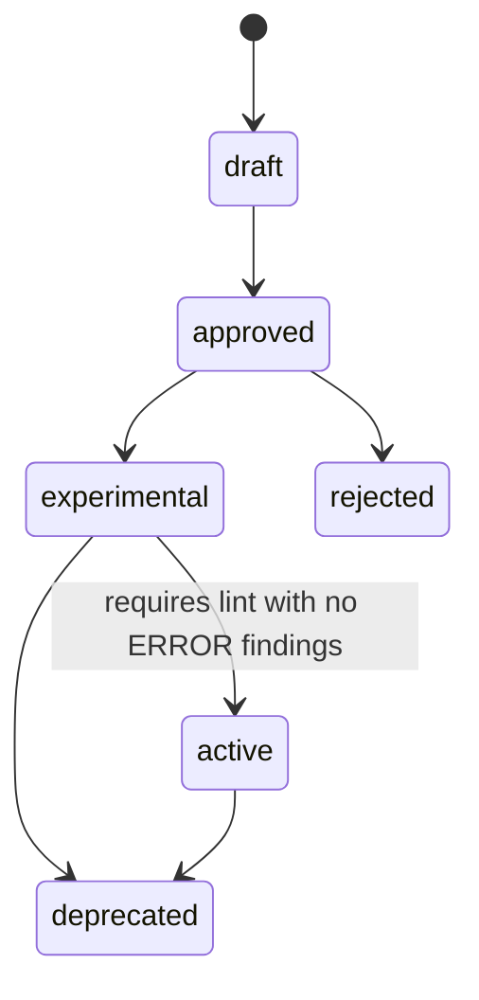

# Architecture

lessonweaver is a governed, deterministic pipeline that turns agent execution
traces into reviewed, reusable operational guidance. There are **no LLM calls**
in the core and **no skill activation without human review**.

## Core abstractions

- **`TraceBundle`** — a captured agent session (id, source, task, ordered
  events, outcome, metadata).
- **`TraceEvent`** — a single event in a session; its kind is a
  `TraceEventType` (message, tool call, error, retry, human correction,
  evaluation result, workflow step, etc.).
- **`LessonCandidate`** — a detected, *unreviewed* potential lesson.
- **`ReviewQuestion` / `ReviewOption` / `ReviewAnswer`** — the multiple-choice
  review interface.
- **`OperationalLesson`** — a reviewed, approved lesson (lower-level artifact).
- **`SkillCard`** — the durable, named, approved skill that can be exported and
  retrieved at runtime.

## Data flow

```mermaid
flowchart LR
    TraceFile[Trace JSON] --> Load[traces.load_trace_bundle]
    Load --> Detect[detection.LessonDetector]
    Detect --> Candidate[LessonCandidate]
    Candidate --> Interview[interview.LessonInterviewer]
    Interview --> Answer[apply_review_answer]
    Answer --> Approve[CLI approve]
    Approve --> Lesson[OperationalLesson]
    Approve --> Skill[SkillCard]
    Skill --> Registry[registry.FileSystemRegistry]
    Skill --> Lint[lint.SkillLinter]
    Lint --> Promote[governance.promote_skill]
    Promote --> Active[active SkillCard]
    Active --> Retrieve[retrieval.SkillRetriever]
    Retrieve --> Compile[compile.SkillCompiler]
    Compile --> Loader[loader.SkillLoader]
    Loader --> Runtime[Agent runtime]
    Skill --> Export[export.export_*]
```

## Module responsibilities

| Module | Responsibility |
| --- | --- |
| `models.py` | Dataclasses and enums for every domain object. |
| `traces.py` | Load and validate trace JSON into a `TraceBundle`. |
| `detection.py` | Deterministic, conservative lesson-candidate detection. |
| `detection_eval.py` | Score detection precision/recall/F1 against a labeled corpus. |
| `clustering.py` | Group recurring candidates across traces by lexical similarity. |
| `interview.py` | Build MCQ review questions and apply answers to a candidate. |
| `registry.py` | Persist/list candidates, lessons, skills, artifacts (JSON files). |
| `export.py` | Render skills/lessons into downstream formats. |
| `retrieval.py` | Rank active skills against a task with a lexical baseline. |
| `compile.py` | Assemble retrieved skills into a context-budgeted snippet. |
| `loader.py` | Public facade: registry + retrieval + compilation. |
| `lint.py` | Deterministic structural/governance checks on a skill. |
| `governance.py` | Guard the skill lifecycle transitions (and lint on activation). |
| `effectiveness.py` | Score post-activation usage and recurrence signals for reviewed skills. |
| `analysis.py` | Detect duplicate, overlapping, or contradictory skills. |
| `validation.py` | Score skill-retrieval correctness (precision/recall) for a suite. |
| `sanitization.py` | Best-effort pre-mining scrub of sensitive trace content. |
| `importers.py` | `TraceImporter` protocol and failure-case import path. |
| `reporting.py` | Report stale, expired, or unused skills. |
| `privacy.py` | `SimpleRedactor` best-effort secret/PII redaction for export. |
| `cli.py` | Command-line entry point wiring the modules together. |

> `events.py` (structured lifecycle events) is described in the backlog but is
> **planned, not yet implemented**. This table lists only what exists today.

## Detection signals

`LessonDetector.detect` is intentionally small. Today it emits a candidate when
it observes any of:

1. an explicit `lesson_candidate` flag in trace metadata;
2. a `human_correction` event;
3. a failed `evaluation_result` event;
4. an `error` followed by a `retry` with a successful/corrected outcome;
5. a failed `tool_call` followed by a later successful one (tool fallback);
6. an `outcome` of `corrected_by_human` (when no explicit correction event).

Each candidate carries a different default `confidence`,
`recommended_action_type`, and `risk_level`. Detection prefers false negatives
over noisy guidance.

## Lesson and skill lifecycles

Lesson status (`LessonStatus`): `candidate` → `needs_review` → `approved` /
`rejected` → `exported` → `deprecated`.

Skill status (`SkillStatus`) and the **guarded** transitions enforced by
`governance.py`:

Guards (from `can_promote_skill` / `promote_skill`):

- Only the transitions above are allowed; anything else raises `ValueError`.
- Promotion to `active` runs `SkillLinter` and is blocked if any finding has
  `ERROR` severity (for example: missing `applies_when`, missing
  `does_not_apply_when`, no instructions, or a high-risk active skill with no
  recorded approver).

## Why lessons are separate from skills

A `LessonCandidate` is ephemeral and unreviewed — a hypothesis. An
`OperationalLesson` is the reviewed decision record. A `SkillCard` is the
durable, named, governed artifact that gets exported and loaded at runtime.
Keeping them separate makes the human-review gate explicit and auditable.

## Extension points

- **New detection signal** — add the smallest deterministic rule to
  `LessonDetector.detect` (`detection.py`); add true-positive, false-positive,
  and edge-case tests. Keep it conservative.
- **New export format** — add an `export_<format>_<target>` function to
  `export.py`, wire it into the CLI `--format` choices only when users call it
  directly, and add a snapshot-style test.
- **New adapter example** — add `examples/<framework>_runtime_loader/` using
  `try/except ImportError`; never add the framework to core dependencies.

## Adapter strategy

All runtime adapters call `SkillLoader.load_for_task(...)` and inject the
resulting snippet into their framework's instruction mechanism. No
framework-specific code belongs in `src/lessonweaver/`; integrations live in
`examples/` and docs.
