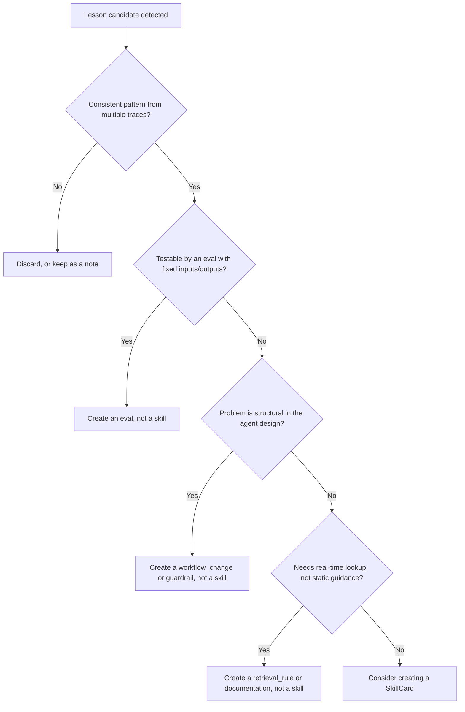

# When *Not* to Create a Skill

lessonweaver is conservative by design. Not every lesson candidate should become
a skill. Turning too many observations into skills causes **context poisoning**:
agents drown in guidance and ignore all of it. This guide helps reviewers and
contributors decide what to do with a candidate.

## The default: lean toward *not* creating a skill

If you are unsure, do not create a skill. Skills are injected into agent context
at runtime. Every unnecessary skill increases context length and the chance of
contradicting other guidance. A candidate that is genuinely valuable will recur
and earn its place.

## Decision tree

## Alternative output types

Every reviewed candidate is assigned a `recommended_action_type`
(`RecommendedActionType` enum). A skill is only one of them.

| Output type | When to use | Example |
| --- | --- | --- |
| `skill` | Consistent behavioral guidance needed at runtime | "Inspect the changed files/diff before concluding a PR review." |
| `eval` | The failure is testable with expected inputs/outputs | "Agent should not approve a PR with failing tests." |
| `guardrail` | The failure is a hard safety violation | "Do not send email to unverified addresses." |
| `instruction_patch` | The system prompt is simply missing a rule | "Add 'do not answer in third person' to the system prompt." |
| `workflow_change` | The failure is architectural, not behavioral | "Add a validation step before publishing." |
| `retrieval_rule` | The guidance depends on context only known at runtime | "Fetch the current refund policy from the knowledge base." |
| `documentation` | The lesson is for humans, not agents | "PR reviews should include a performance note." |
| `test` | The lesson is a regression test, not guidance | "Add a test for the empty-list input edge case." |
| `reject` | No consistent pattern; a one-off error | Discard the candidate. |

## Context poisoning risks

If an agent carries too many skills, it may:

- ignore all of them because the context is too long;
- apply a skill from an unrelated domain;
- act on contradictory guidance from overlapping skills.

Signs a skill library is too large:

- more than ~20 skills loaded per task;
- multiple skills with overlapping `applies_when` scope (see `SkillAnalyzer`,
  which flags overlaps and contradictions);
- low retrieval precision (relevant skills buried under noise).

## The conservative default rule

Do **not** create a skill if any of these are true:

- only one trace shows the pattern;
- an eval would catch the problem reliably;
- the lesson is already covered by the system prompt;
- the lesson is too vague to state as a specific, qualified rule.

## How lessonweaver enforces this

- **Detection is conservative.** `LessonDetector` emits few, high-signal
  candidates and prefers false negatives over noise.
- **Review is mandatory.** The `action_type` and `decision` review questions
  (`LessonInterviewer`) force an explicit choice among the output types above,
  including `reject`.
- **Linting discourages absolutes.** `SkillLinter` warns on unqualified
  "always"/"never" language and requires explicit `does_not_apply_when` bounds.
